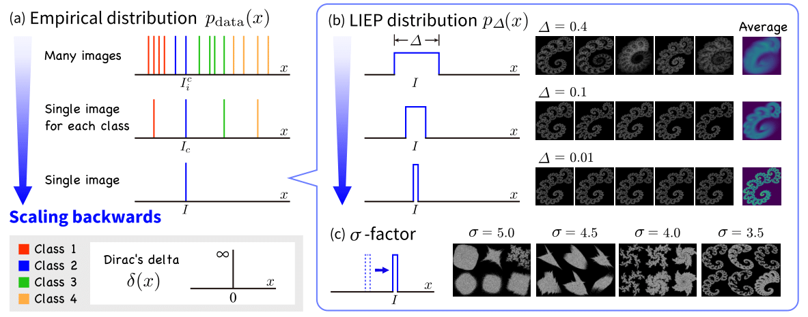

# 1p-frac (1-parameter Fractal as Data)

This repository contains the code for generating data with 1p-frac. In 1p-frac, we control the distribution of shape variations using the parameter Δ. Even with very small shape variations, such as Δ=0.1, it achieves pre-training effects close to real data.

  

## Running the Code
To generate 1p-frac data, first specify the hyperparameters in `generate.sh`.

    BASE_SAVEDIR="/path/to/savedir"  # directory to save 1p-frac data
    SIGMA=4.0  # parameter to control shape complexity
    DELTA=0.1  # parameter to control shape variance
    SAMPLE=1000  # Number of samples from the shape distribution controlled by delta

Then, run the code as follows:

    cd 1p-frac/1p-frac_generator
    bash generate.sh

## Dataset Sample
As an example, when adding shape variations in the range of Δ to single fractal, the distribution of shape changes will look as follows based on Δ:

|   |
|:---:|
Δ = 0.01

|   |
|:---:|
Δ = 0.05

|   |
|:---:|
Δ = 0.1
