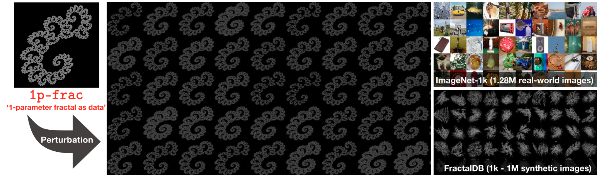

# Scaling Backwards: Minimal Synthetic Pre-training? (ECCV'24)

## Summary

This repository is based on the paper by Ryo Nakamura*, Ryu Tadokoro* (* indicates equal contribution), Ryosuke Yamada, Yuki M. Asano, Iro Laina, Christian Rupprech, Nakamasa Inoue, Rio Yokota, and Hirokatsu Kataoka, titled "Scaling Backwards: Minimal Synthetic Pre-training?", presented at the European Conference on Computer Vision (ECCV) 2024.  
<!-- [[Project](https://masora1030.github.io/Visual-Atoms-Pre-training-Vision-Transformers-with-Sinusoidal-Waves/)]  -->  
[[arXiv](https://arxiv.org/abs/2408.00677)]  [[Dataset](https://drive.google.com/drive/folders/1iJSiDaqsoWWP5s7Z5BvI1XypXSOPXV1R?usp=drive_link)]  [[Supp]()]

<p align="center">  </p>  
Comparison of ImageNet-1k, FractalDB, and 1p-frac (ours). 1p-frac consists of only a single fractal for pre-training. With 1p-frac, neural networks learn to classify perturbations applied to the fractal. In our study, "single" refers to a very narrow distribution over parameters that leads to images that are roughly equivalent from a human visual perspective. While the shape differences of perturbed images can be indistinguishable to humans, models pre-trained on 1p-frac achieve performance comparable to those pre-trained on ImageNet-1k or FractalDB.

## 1-parameter Fractal as Data (1p-frac)
|   |
|:---:|

Below are some datasets and pre-trained models using ViT Tiny with 1p-frac. If you want to use 1p-frac, please download them from the link below.

| Model | σ-factor | Δ | Sample num | Acc@CIFAR100 | Pretrained weights | Dataset link |
|--|--|--|--|--|--|--|
| vit_tiny_patch16_224 | 3.5 | 0.01 | 1k | 19.9 | [Drive](https://drive.google.com/file/d/1XdxaD70tVhdWqwXGmpp7S4vro_06cWhT/view?usp=sharing) | [Drive](https://drive.google.com/file/d/1Qh62RiouchFDAL9pePjsDFpWiI9fwmMd/view?usp=sharing) |
| vit_tiny_patch16_224 | 3.5 | 0.05 | 1k | 83.0 | [Drive](https://drive.google.com/file/d/1zPIVGLDKic80agypEPEAnVYQ0hyLwHEw/view?usp=sharing) | [Drive](https://drive.google.com/file/d/1c3KTxFy0YTFztpaNY3FCzLqrclymynOZ/view?usp=sharing) |
| vit_tiny_patch16_224 | 3.5 | 0.1 | 1k | **84.2** | [Drive](https://drive.google.com/file/d/1D9uQbvhI6DWRrataQCezcULXxRidb-0V/view?usp=sharing) | [Drive](https://drive.google.com/file/d/1QHy9ypdMiKyBipl-nXjTJ9M5C_HhSeb4/view?usp=sharing) |
| vit_tiny_patch16_224 | 3.5 | 0.2 | 1k | 83.4 | [Drive](https://drive.google.com/file/d/1MWahtdLKtTmrtV_bi65FefktXsZlzBM2/view?usp=sharing) | [Drive](https://drive.google.com/file/d/1MxmuBBWbCn9WvkLU58wjNXj1ygkfVThf/view?usp=sharing) |

## Implementation
### Requirements
This section details the environment required to generate the 1p-frac dataset, pre-train the generated 1p-frac, or fine-tune the pretrained model.

* Python 3.x (tested on 3.7.9)
* CUDA (tested on 10.2)
* CuDNN (tested on 7.6)
* NCCL (tested on 2.7)
* OpenMPI (tested on 4.1.3)
* Graphics board (tested on single/four NVIDIA V100 GPUs)

Install the required packages using the following commands:

```bash
$ pip install --upgrade pip
$ pip install -r requirements.txt
```

### Generate 1p-frac ([README](1p-frac_generater/README.md))
To generate the 1p-frac dataset, refer to the [1p-frac_generater directory](1p-frac_generater) and execute the following commands:

```bash
$ cd 1p-frac_generater
$ bash generate_1p-frac.sh
```

### Pre-training & Finetuning ([README](train/README.md))
If you want to pre-train the generated 1p-frac or fine-tune with the pre-trained model, refer to the [train directory](train) and execute the following commands:

```bash
$ cd train
$ bash pre-training.sh
```

```bash
$ cd train
$ bash finetune.sh
```

## Citation
If you use our work in your research, please cite our paper:
```bibtex
@InProceedings{xxxxxx,
    title={Scaling Backwards: Minimal Synthetic Pre-training?},
    author={Ryo Nakamura, Ryu Tadokoro, Ryosuke Yamada, Yuki M. Asano, Iro Laina, Christian Rupprech, Nakamasa Inoue, Rio Yokota and Hirokatsu Kataoka},
    booktitle={Proceedings of the European Conference on Computer Vision (ECCV)},
    year={2024},
}
``` 

## Terms of use
The authors affiliated in the National Institute of Advanced Industrial Science and Technology (AIST) and Tokyo Institute of Technology (TITech) are not responsible for the reproduction, duplication, copy, sale, trade, resale, or exploitation for any commercial purposes of any portion of the images or any derived data. In no event will we be liable for any damages resulting from this data or any derived data.

## Acknowledgements
This repository is based on [2D/3D-OFDB](https://github.com/ryoo-nakamura/OFDB).
